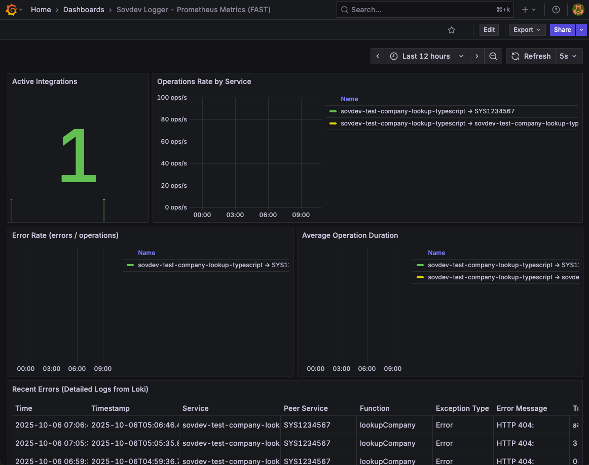

# sovdev-logger

**Multi-language structured logging with zero-effort observability**

One log call. Complete observability. Available for TypeScript, Python, C#, Go, Rust, PHP, and more.

---

## What is sovdev-logger?

Stop writing separate code for logs, metrics, and traces. Write one log entry and automatically get:

- ✅ **Structured logs** (Azure Log Analytics, Loki, or local files)
- ✅ **Metrics dashboards** (Azure Monitor, Prometheus, Grafana)
- ✅ **Distributed traces** (Azure Application Insights, Tempo)
- ✅ **Service dependency maps** (automatic correlation)

**Works with any OpenTelemetry-compatible backend**: Azure Monitor, Grafana Cloud, Datadog, New Relic, Honeycomb, or self-hosted infrastructure.

---

## The Problem: Traditional Observability is Complex

```typescript
// Traditional approach: 20+ lines per operation
logger.info('Payment processed', { orderId: '123' });
paymentCounter.inc();
paymentDuration.observe(duration);
const span = tracer.startSpan('processPayment');
span.setAttributes({ orderId: '123' });
span.end();
// ... manually correlate logs, metrics, traces
```

## The Solution: Zero-Effort Observability

```typescript
// sovdev-logger: 1 line, complete observability
const FUNCTIONNAME = 'processPayment';
const input = { orderId: '123', amount: 99.99 };
const output = { transactionId: 'tx-456', status: 'approved' };

sovdevLog(INFO, FUNCTIONNAME, 'Payment processed', PEER_SERVICES.PAYMENT_GATEWAY, input, output);
// ↑ Automatic logs + metrics + traces + correlation
```

**Result**: 95% less instrumentation code, complete observability out of the box.

---

## Who Do You Write Logs For?

You write code for yourself during development. But **you write logs for the operations engineer staring at a screen at 7 PM on Friday.**

Picture this: Your application just crashed in production. Everyone on your team has left for the weekend. The ops engineer who got the alert doesn't know your codebase, doesn't know your business logic, and definitely doesn't want to be there right now. They're trying to piece together what went wrong from cryptic error messages and scattered log entries.

**Make their job easy.**

Good logging is the difference between:

- ❌ "Some null reference exception occurred somewhere" *(cue 3-hour debugging session)*
- ✅ "User authentication failed for email 'john@company.com' - invalid password attempt #3, account locked for security" *(fixed in 5 minutes)*

When you write clear, contextual logs, you're not just debugging future problems—**you're earning respect**. That ops engineer will look up who wrote this beautifully logged code and think: *"Now THIS is a developer who knows what they're doing."*

Help them get home to their family. Help yourself build a reputation as someone who writes production-ready code.

**Your future self (and your colleagues) will thank you.**

---

## Supported Languages

| Language | Status | Documentation |
|----------|--------|---------------|
| **TypeScript** | ✅ Available | [typescript/README.md](typescript/README.md) |
| **Python** | 🚧 Coming Soon | - |
| **C#** | 🚧 Coming Soon | - |
| **Go** | 🚧 Coming Soon | - |
| **Rust** | 🚧 Coming Soon | - |
| **PHP** | 🚧 Coming Soon | - |

---

## Quick Start

### TypeScript/JavaScript

```bash
npm install @sovdev/logger
```

See [typescript/README.md](typescript/README.md) for complete documentation.

### Python (Coming Soon)

```bash
pip install sovdev-logger
```

### C# (Coming Soon)

```bash
dotnet add package SovdevLogger
```

### Go (Coming Soon)

```bash
go get github.com/norwegianredcross/sovdev-logger
```

---

## For Microsoft/Azure Developers

**"I only know Azure Monitor and Application Insights..."**

Good news! This library uses **OpenTelemetry** - Microsoft's recommended standard for observability. Your code works with **both** Azure and open-source tools:

```typescript
// Same code works everywhere
sovdevLog(INFO, FUNCTIONNAME, 'Order processed', PEER_SERVICES.INTERNAL, input, output);
```

**Where your logs go**:

| Environment | Logs | Metrics | Traces |
|------------|------|---------|---------|
| **Azure Production** | Azure Log Analytics | Azure Monitor | Application Insights |
| **Local Development** | Console + JSON files | Grafana (optional) | Tempo (optional) |
| **On-Premises** | Loki | Prometheus | Tempo |

**Key benefits for Azure developers**:
- ✅ **No vendor lock-in**: Write once, deploy anywhere (Azure, AWS, on-prem)
- ✅ **Local testing**: Full observability stack on your laptop (no cloud costs)
- ✅ **Azure-compatible**: OpenTelemetry Protocol (OTLP) works with Azure Monitor
- ✅ **Future-proof**: Microsoft recommends OpenTelemetry for new applications

---

## See It In Action


*Logs visualized in Grafana with automatic traceId correlation, service tracking, and peer service mapping*

---

## What You Get Automatically

```
┌─────────────────────────────────────────────────────┐
│  Your Code: sovdevLog(...)                         │
│             ↓                                       │
│  One Log Call                                       │
└──────────────┬──────────────────────────────────────┘
               │
    ┌──────────┼──────────┬──────────┐
    ↓          ↓          ↓          ↓
┌────────┐ ┌────────┐ ┌────────┐ ┌────────┐
│ Logs   │ │Metrics │ │Traces  │ │ File   │
│Azure LA│ │Azure   │ │App     │ │ (JSON) │
│  Loki  │ │Monitor │ │Insights│ │        │
│        │ │Grafana │ │ Tempo  │ │        │
└────────┘ └────────┘ └────────┘ └────────┘
```

Every log call generates:
- **Logs**: Structured JSON with full context (what happened, input, output)
- **Metrics**: Counters, histograms, gauges for Azure Monitor, Prometheus, or Grafana
- **Traces**: Distributed tracing spans with automatic correlation (Azure Application Insights, Tempo)
- **Service Maps**: Automatic dependency graphs showing system-to-system calls
- **File Logs**: Optional JSON files for local development and debugging

**No extra code required.**

---

## Example: TypeScript

```typescript
import { sovdevInitialize, sovdevLog, sovdevFlush, SOVDEV_LOGLEVELS, createPeerServices } from '@sovdev/logger';

// Define external systems your app calls
const PEER_SERVICES = createPeerServices({
  PAYMENT_GATEWAY: 'SYS2034567'  // INTERNAL is auto-generated
});

// Initialize at app startup (before any logging)
sovdevInitialize(
  'my-payment-service',      // Service name
  '1.0.0',                   // Version (optional, auto-detected from package.json)
  PEER_SERVICES.mappings     // Peer service mappings (optional)
);

async function processPayment(orderId: string, amount: number) {
  const FUNCTIONNAME = 'processPayment';

  const input = { orderId, amount };

  try {
    const result = await paymentGateway.charge(orderId, amount);
    const output = { transactionId: result.id, status: 'approved' };

    sovdevLog(
      SOVDEV_LOGLEVELS.INFO,
      FUNCTIONNAME,
      'Payment processed successfully',
      PEER_SERVICES.PAYMENT_GATEWAY,  // Tracks call to external system
      input,
      output
    );

    return result;
  } catch (error) {
    sovdevLog(
      SOVDEV_LOGLEVELS.ERROR,
      FUNCTIONNAME,
      'Payment failed',
      PEER_SERVICES.PAYMENT_GATEWAY,
      input,
      { status: 'failed', reason: error.message },
      error
    );
    throw error;
  }
}

// Flush before exit (CRITICAL - prevents log loss!)
process.on('beforeExit', async () => {
  await sovdevFlush();
});
```

---

## Configuration

### Local Development (Console + File Only)

**No configuration needed!** Just install and use. The library will:
- ✅ Log to console (colored, human-readable)
- ✅ Log to files (JSON, structured in `./logs/`)
- ❌ Not send to OTLP (Grafana/Loki) yet

### Grafana/Loki/Tempo (Local Observability Stack)

Create `.env` file:

```bash
OTEL_EXPORTER_OTLP_LOGS_ENDPOINT=http://127.0.0.1/v1/logs
OTEL_EXPORTER_OTLP_METRICS_ENDPOINT=http://127.0.0.1/v1/metrics
OTEL_EXPORTER_OTLP_TRACES_ENDPOINT=http://127.0.0.1/v1/traces
OTEL_EXPORTER_OTLP_HEADERS={"Host":"otel.localhost"}

NODE_ENV=development
```

See language-specific documentation for complete configuration details.

---

## Documentation

### Quick Start by Language

- **TypeScript**: [typescript/README.md](typescript/README.md) - Complete API reference, examples, patterns
- **Python**: Coming soon
- **C#**: Coming soon
- **Go**: Coming soon

### Detailed Documentation

- **[Configuration Guide](docs/README-configuration.md)** - Environment variables, OTLP setup, file logging
- **[Log Data Structure](docs/logging-data.md)** - Field reference, logging patterns, correlation strategies
- **[Observability Architecture](docs/README-observability-architecture.md)** - Dashboard setup, systemId naming, verification
- **[Loggeloven Compliance](docs/README-loggeloven.md)** - Norwegian Red Cross logging requirements
- **[Microsoft/Azure Integration](docs/README-microsoft-opentelemetry.md)** - Azure Monitor, Application Insights setup

---

## Contributing

See [CONTRIBUTING.md](CONTRIBUTING.md) for guidelines on how to contribute to this project.

---

## License

MIT License - Copyright (c) 2025 Norwegian Red Cross

See [LICENSE](LICENSE) for details.

---

## Support

- **GitHub Issues**: [https://github.com/norwegianredcross/sovdev-logger/issues](https://github.com/norwegianredcross/sovdev-logger/issues)
- **Documentation**: See language-specific README files in each directory

---

## Repository Status

This repository is currently under development. The TypeScript implementation is complete and ready for use. Additional language implementations are planned for 2025.

**Phase 1**: TypeScript (✅ Complete)
**Phase 2**: Python (🚧 In Progress)
**Phase 3**: C#, Go, Rust, PHP (📅 Planned)
