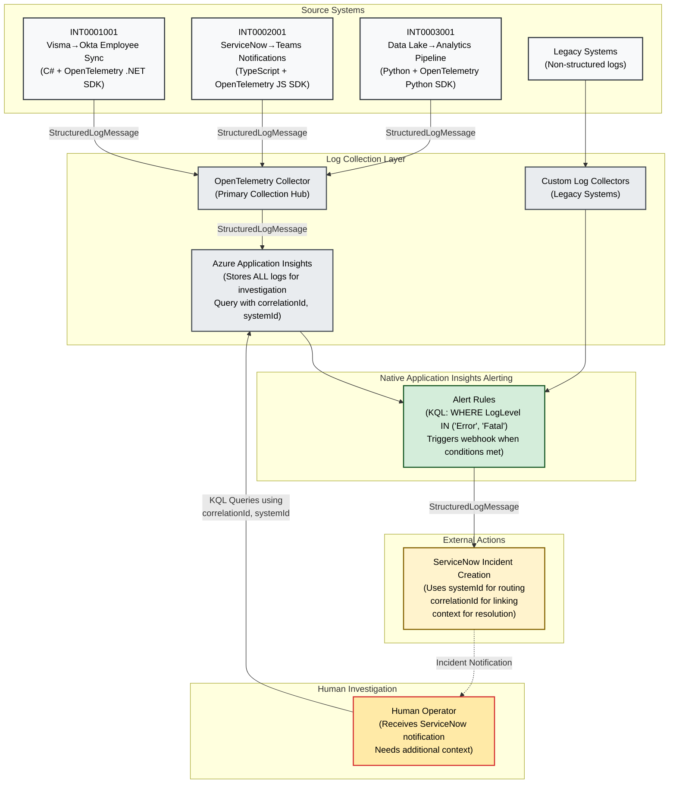

# Red Cross Norway - About Logging

Information and requirements about logging and how to do it so that finding and solving bugs is possible.

## Loggeloven av 2025

### §1 - System Identification
Every system that produces logs SHALL have a unique system identifier. This identifier MUST be included in all log entries to enable correlation with incident management systems.

### §2 - Log Level Standards
All systems MUST use the standardized log levels: Trace, Debug, Info, Warn, Error, and Fatal. The Error and Fatal levels SHALL trigger incident management workflows.

### §3 - Structured Format Requirement
All log entries MUST be structured using JSON format. Unstructured text-based logging is prohibited for production systems.

### §4 - Naming Convention Standard
All log field names MUST use camelCase convention. Consistent field naming across systems is mandatory for correlation and analysis.

### §5 - Context Information Requirement
Log entries MUST include sufficient context to understand what caused an error, including:
- Input parameters that led to the error
- System state at time of error
- Function or method name where error occurred

### §6 - Error Location Identification
Every log entry MUST identify where the error occurred by including:
- System identifier
- Function or method name
- Relevant context variables

### §7 - Correlation Support
Log entries MUST include correlation identifiers (session_id, trace_id, event_id) to enable tracing across multiple systems and services.

### §8 - Field Name Consistency
Systems SHOULD strive for consistent field names across the organization when possible. When integrating with external systems, original field names MAY be preserved, but systems SHOULD provide mapping or transformation to organizational standards where feasible. The same entity SHOULD use consistent field names in internally developed systems (e.g., prefer "userId" over varying names like "employee" or "employmentId").

### §9 - Machine Readability
All log entries MUST be machine-readable and processable by automated monitoring and alerting systems.

### §10 - Human Readability
Despite being structured, log messages MUST include human-readable descriptions to enable manual investigation and debugging.

In this document we refer to a "log entry" as a `StructuredLogMessage`. This is a JSON object that contains all the necessary information to understand the log entry, including the system ID, function name, and any relevant context.

## Log flow

The following diagram illustrates the flow of logs from source systems through collection, processing, and incident management, highlighting the use of structured logging and correlation identifiers.



The log starts as a `StructuredLogMessage` in the source system, which is then collected by the OpenTelemetry (open standard for logging) Collector. The logs are sent to Azure Application Insights, where they are stored and can be queried using correlation identifiers and system IDs. If an error occurs, alert rules trigger notifications to ServiceNow, which creates incidents for human operators to investigate. The operator can query Application Insights using correlation IDs and system IDs to find the relevant logs and context needed to resolve the incident.

The vital part is that the `StructuredLogMessage` contains the nessesary information (eg systemId="INT0001001") for ServiceNow to to route the incident to the correct queue/person.
When the hunam operatorreceives the incident notification, they will see a message that includes the system ID, function name, and other relevant context. This allows them to quickly understand the issue.
If, and only IF, the operator needs more information, they can query Application Insights using the correlation ID and system ID to find the relevant logs.

## Why Loggeloven av 2025 was created

- [Goal](#goal)
- [The Challenge](#the-challenge)
- [How Structured Logging Solves These Challenges](#how-structured-logging-solves-these-challenges)
- [System Identification and Incident Management](#system-identification-and-incident-management)
- [Common Log Levels](#common-log-levels)
- [Unified Logging Format](#unified-logging-format)
- [Essential Logging Information](#essential-logging-information)
- [Implementation Example](#implementation-example)

## Goal

The goal is to have logs that make it possible to quickly find and solve bugs, while being easy to read, understand, and process programmatically. This document defines standards for structured logging across all systems to enable effective debugging and incident resolution.

## The Challenge

Modern applications face significant challenges when it comes to effective logging:

- **Inconsistent formats**: Different systems and developers use varying log formats, making it difficult to correlate events across services
- **Lack of context**: Traditional text-based logs often miss crucial contextual information needed for debugging
- **Poor searchability**: Unstructured logs are hard to query and filter when investigating issues
- **Limited correlation**: Without proper structure, it's nearly impossible to trace requests across multiple services
- **Manual analysis**: Debugging becomes a time-consuming manual process of parsing through verbose, unstructured text

## How Structured Logging Solves These Challenges

Structured logging addresses these problems by:

- **Consistent format**: Using standardized formats like JSON ensures all logs follow the same structure
- **Rich context**: Each log entry can include relevant metadata, request IDs, user context, and system state
- **Enhanced searchability**: Structured data can be easily queried, filtered, and aggregated using log management tools
- **Improved correlation**: Request tracing and service correlation become straightforward with proper identifiers
- **Automated analysis**: Structured logs enable automated monitoring, alerting, and analysis workflows

## System Identification and Incident Management

When a log is above the Error threshold, it is considered an incident. Incidents need to be investigated and solved through our incident management system, ServiceNow.

Every system that logs has an ID. This ID string uniquely identifies the system and is used to correlate logs with incidents. For integrations, the ID looks like this: `INT0001001`

## Common Log Levels

Best practices for logging suggest using a common set of log levels to ensure consistency across systems:

- **Trace**: Very detailed logs, typically used for debugging. Should be used sparingly in production.
- **Debug**: Detailed information useful for debugging issues. Should be used to log information that is helpful during development and troubleshooting.
- **Info**: General information about application events. Should be used to log significant application events that are not errors.
- **Warn**: Indications of potential issues that are not errors. Should be used to log situations that could lead to errors but are not critical.
- **Error**: Errors that occur during application execution. Should be used to log exceptions and errors that need attention.
- **Fatal**: Critical errors that cause the application to terminate. Should be used to log severe errors that require immediate attention.

## Unified Logging Format

There are many logging systems in use, many specially tailored to the needs of the system. We can't enforce a single logging system, but we can enforce a single logging format.

Common for all logging systems is that they have a "message" or similar string field. Developers usually write the message in a human-readable format. Everyone can read it, but people and certainly not machines can easily understand it.

### Unstructured Logging Example

Traditional unstructured logging creates messages that are hard to parse:

```csharp
catch (Exception ex)
{
    log.LogError($"Handle_New_Employee failed userCreationInfo=({userCreationInfo.ToString()}) failure message={ex.Message}. Returning HTTP=500");
    return new HttpResponseMessage(HttpStatusCode.InternalServerError)
    {
        Content = new StringContent("An internal error occurred", Encoding.UTF8, "text/plain")
    };
}
```

This creates a log message like:

```plaintext
Handle_New_Employee failed userCreationInfo=(ProcessedAt:20250610131205;SourceSystem:VismaToOkta;EmploymentId:26943;FirstName:Natnael;LastName:Abraham;defaultSignature:105010NAAB;defaultEmail:natnael.abraham@redcross.no;uniqueSignature:105010NAAB;uniqueEmail:natnael.abraham@redcross.no;) failure message=RecipientRespondedWithFailure: Cannot update. Userid is already in use by another ansatt. SessionId=010225 CorrelationId=d04584f7-bf95-41e0-9e20-f8063b7658b6 Employee=26943
```

This log message is a long string that contains a lot of information but is not structured and not easy to parse or read.

### Structured Logging Example

The same information in a structured format:

```json
{
  "event": "handleNewEmployeeFailed",
  "userCreationInfo": {
    "processedAt": "20250610131205",
    "sourceSystem": "VismaToOkta",
    "employmentId": "26943",
    "firstName": "Natnael",
    "lastName": "Abraham",
    "defaultSignature": "105010NAAB",
    "defaultEmail": "natnael.abraham@redcross.no",
    "uniqueSignature": "105010NAAB",
    "uniqueEmail": "natnael.abraham@redcross.no"
  },
  "failureMessage": "RecipientRespondedWithFailure: Cannot update. Userid is already in use by another ansatt.",
  "sessionId": "010225",
  "correlationId": "d04584f7-bf95-41e0-9e20-f8063b7658b6",
  "employeeId": "26943"
}
```

### Consistent Naming Conventions

We use **snake_case** for all field names in sovdev-logger to ensure consistency across systems and programming languages. This makes logs easier to process and correlate.

### Consistent Field Names

We need a consistent set of field names used across all systems. If a field represents a user, it should always be called `user_id`, not `employee` or `employment_id`. This consistency allows easy correlation of logs across systems.

**TODO**: Create a list of common field names that should be used across all systems.

## Essential Logging Information

### What Caused the Error?

When an error occurs, log the information that was used to determine this is an error. For example, if a received JSON structure didn't match the expected structure, include the received JSON so investigators can see what was wrong.

### Where Did the Error Occur?

Log where the error occurred by including:

- **System ID**: The unique identifier for the system
- **Function/Method name**: The specific function where the error occurred

Example in TypeScript:

```typescript
async function getOrganizationsByName(orgName: string): Promise<BrregAPIResponse[]> {
    const functionName = "getOrganizationsByName";
    // ... rest of function
}
```

## Implementation Example

The example below demonstrates how to implement structured logging in a TypeScript function that retrieves organizations by name from the Brønnøysund Register Centre (Brreg) API. The api is called every time brreg makes a change to an organization, such as when a new organization is created or an existing organization is updated.
This means that the function is called thousands of times every week. And if there is an error the operator must be able to quickly find the error and solve it.

Notice

```typescript

const LOGGER_SYSTEM = "brreglib";

/** getOrganizationsByName
 * Takes a organization name as parameter
 * @param {string} orgName - the name of the organization to search for
 * @returns {array} - array of organizations that match the name - if none found returns an empty array
 * Returns an array of organizations based on brreg fuzzy search - probably a page of 20 organizations
 The data returned is described here https://data.brreg.no/enhetsregisteret/api/docs/index.html#enheter-oppslag
 */
export async function getOrganizationsByName(orgName:string) : Promise<BrregAPIResponse[]> {

    const functionName = "getOrganizationsByName";
    const BRREG_ENHETER_URL = "https://data.brreg.no/enhetsregisteret/api/enheter/";
    let brregRequestURL;
    let orgNameSearchTxt = "";
    let foundOrganizationsArray : any[] = [];
    let axiosResponse : any = {};

    let myVariables = {
        "orgName": orgName,
        "response": "not set"
    };


    if (orgName) { // has value and is not null 

        orgNameSearchTxt = orgName.toString(); //make sure we are dealing with a string
        orgNameSearchTxt = orgNameSearchTxt.toUpperCase();
        orgNameSearchTxt = orgNameSearchTxt.trim();


        orgNameSearchTxt = encodeURIComponent(orgNameSearchTxt); // encode it correctly

        brregRequestURL = BRREG_ENHETER_URL + "?navn=" + orgNameSearchTxt;

        try {
            axiosResponse = await axios.get(brregRequestURL);

            if (null != axiosResponse.data.page) { // there is a result set            
                if (axiosResponse.data.hasOwnProperty('_embedded')) {
                    if (axiosResponse.data._embedded.hasOwnProperty('enheter')) {
                        foundOrganizationsArray = axiosResponse.data._embedded.enheter;
                    } else {
                        let logMessage = "DataIntegrety: no enheter.";
                        myVariables.response = JSON.stringify(axiosResponse);
                        let logObject = createLogSystemObject( functionName, null, myVariables, LOGGER_SYSTEM);
                        logger.info(logMessage, logObject);
                        debugger
                    }

                } else {
                    let logMessage = "DataIntegrety: no _embedded.";
                    myVariables.response = JSON.stringify(axiosResponse);
                    let logObject = createLogSystemObject( functionName, null, myVariables, LOGGER_SYSTEM);
                    logger.info(logMessage, logObject);
                    debugger
                }

            } else {
                let logMessage = "DataIntegrety: no page.";
                myVariables.response = JSON.stringify(axiosResponse);
                let logObject = createLogSystemObject( functionName, null, myVariables, LOGGER_SYSTEM);
                logger.info(logMessage, logObject);
                debugger
            }


        }
        catch (e) {
            myVariables.response = JSON.stringify(axiosResponse);
            let logMessage = "catchError";
            let logObject = createLogSystemObject( functionName, e, myVariables, LOGGER_SYSTEM);
            logger.error(logMessage, logObject);
    
        }


    } else { // has no value eg. null 
        foundOrganizationsArray = []; // return an empty array
    }

    return foundOrganizationsArray;

}
```

Key points in this example:

1. **System ID**: Set to "brreglib" for consistent identification
2. **Function name**: Captured for precise error location
3. **Context variables**: Important parameters and responses stored for debugging
4. **Appropriate log levels**: Info for data issues, Error for exceptions
5. **Structured format**: Uses `createLogSystemObject` to ensure consistent structure
6. **Human-readable messages**: Clear, descriptive log messages

This approach ensures that when errors occur, operators can quickly identify the system, function, and context needed to resolve issues efficiently.