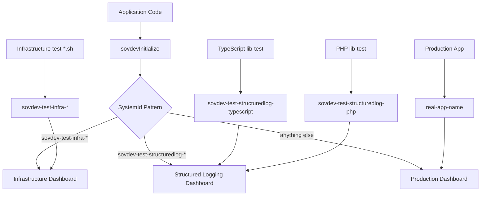

# 📊 sovdev Observability Architecture

## 🎯 Overview

This document explains how the sovdev multi-language logging system integrates with Grafana dashboards for comprehensive observability. The architecture separates concerns between testing verification and production monitoring while maintaining consistency across all programming languages.

## 📋 Three-Dashboard Architecture

### 1. Infrastructure Testing Dashboard
- **File**: `dev-observability-stack/grafana/dashboards/test-dev-observability-infra-dashboard.json`
- **Purpose**: Verify OTLP pipeline connectivity and observability stack health
- **Filter**: `systemId =~ /^sovdev-test-infra-.*/`
- **Use Cases**:
  - OTLP collector connectivity verification
  - Loki ingestion testing
  - Pipeline health monitoring
  - Infrastructure troubleshooting

### 2. Structured Logging Testing Dashboard
- **File**: `dev-observability-stack/grafana/dashboards/test-dev-observability-structuredlog-dashboard.json`
- **Purpose**: Verify structured logging library implementations across all languages
- **Filter**: `systemId =~ /^sovdev-test-structuredlog-.*/`
- **Use Cases**:
  - Library implementation verification
  - Cross-language consistency checking
  - "Loggeloven av 2025" compliance validation
  - Developer integration testing

### 3. Production Monitoring Dashboard
- **File**: `dev-observability-stack/grafana/dashboards/structuredlog-dashboard.json`
- **Purpose**: Monitor real application logs in production and development
- **Filter**: `systemId AND systemId !~ /^sovdev-test-.*/`
- **Use Cases**:
  - Application health monitoring
  - Error tracking and alerting
  - Performance insights
  - Business logic monitoring

## 🏷️ SystemId Naming Convention

The `systemId` parameter passed to `sovdevInitialize()` determines which dashboard will display the logs:

### Infrastructure Testing
```bash
# Used by dev-observability-stack/test-*.sh scripts
sovdevInitialize("sovdev-test-infra-raw-logs")
sovdevInitialize("sovdev-test-infra-otlp-connectivity")
sovdevInitialize("sovdev-test-infra-loki-ingestion")
```

### Structured Logging Testing
```typescript
// TypeScript
sovdevInitialize("sovdev-test-structuredlog-typescript")

// PHP
sovdevInitialize("sovdev-test-structuredlog-php")

// Go
sovdevInitialize("sovdev-test-structuredlog-go")

// Java
sovdevInitialize("sovdev-test-structuredlog-java")

// Python
sovdevInitialize("sovdev-test-structuredlog-python")

// C#
sovdevInitialize("sovdev-test-structuredlog-csharp")
```

### Production Applications
```typescript
// Real application names
sovdevInitialize("user-management-service")
sovdevInitialize("payment-processor")
sovdevInitialize("inventory-system")
sovdevInitialize("INT0001001")  // Red Cross style system IDs
```

## 🔍 How to Verify Your Implementation

### For Library Developers

#### 1. Run Your Language's Test
```bash
# TypeScript
npm run lib-test

# PHP (future)
composer run lib-test

# Go (future)
go run lib-test

# Java (future)
mvn lib-test

# Python (future)
python lib-test.py

# C# (future)
dotnet run lib-test
```

#### 2. Check the Structured Logging Dashboard
- Open Grafana: `http://localhost:3000`
- Navigate to: **test-dev-observability-structuredlog-dashboard**
- Look for logs with your systemId: `sovdev-test-structuredlog-{language}`

#### 3. Verify Required Functionality
The dashboard should show evidence of:
- ✅ **Basic structured logging**: All required fields present
- ✅ **Job lifecycle tracking**: Start → Progress → Completion
- ✅ **Error handling**: Exception logging with stack traces
- ✅ **Trace-log correlation**: Trace IDs in log entries
- ✅ **All log levels**: TRACE, DEBUG, INFO, WARN, ERROR, FATAL

### For Infrastructure Maintainers

#### 1. Run Infrastructure Tests
```bash
cd dev-observability-stack
./test-raw-logs.sh
./test-otlp-connectivity.sh
```

#### 2. Check the Infrastructure Dashboard
- Open Grafana: `http://localhost:3000`
- Navigate to: **test-dev-observability-infra-dashboard**
- Look for logs with systemIds: `sovdev-test-infra-*`

#### 3. Verify Pipeline Health
The dashboard should show:
- ✅ **OTLP connectivity**: Logs reaching the collector
- ✅ **Loki ingestion**: Data flowing to Loki
- ✅ **Component health**: All observability stack components running

### For Application Developers

#### 1. Deploy Your Application
```typescript
// In your application code
sovdevInitialize("my-application-name");
```

#### 2. Check the Production Dashboard
- Open Grafana: `http://localhost:3000`
- Navigate to: **structuredlog-dashboard**
- Look for logs with your application's systemId

## 🏗️ Architecture Flow



## 📊 Data Flow

### 1. Log Generation
```typescript
// Developer writes code
sovdevLog(SOVDEV_LOGLEVELS.INFO, "MyFunction", "Processing started", PEER_SERVICES.INTERNAL,
       {userId: 123}, {status: "started"});
```

### 2. OpenTelemetry Processing
- Winston captures the log
- OpenTelemetry auto-instrumentation adds trace context
- OTLP exporter sends to observability stack

### 3. Observability Stack
- OTLP Collector receives logs and traces
- Data flows to Loki (logs) and Tempo (traces)
- Grafana queries both for correlated observability

### 4. Dashboard Display
- Grafana filters logs by systemId pattern
- Displays in appropriate dashboard
- Shows trace-log correlation

## 🎯 Design Principles

### Separation of Concerns
- **Infrastructure testing**: Focuses on pipeline health
- **Library testing**: Focuses on implementation compliance
- **Production monitoring**: Focuses on application health

### Language Consistency
All programming languages implement:
- Identical `lib-test` functionality
- Same structured log format
- Consistent systemId naming
- Same verification process

### Future-Proof Naming
The `sovdev-test-*` prefix allows adding new test categories without changing dashboard filters:
```bash
# Current
sovdev-test-infra-*
sovdev-test-structuredlog-*

# Future possibilities
sovdev-test-integration-*
sovdev-test-performance-*
sovdev-test-security-*
```

## 🔧 Configuration

### Environment Variables
```bash
# Required for OTLP integration
export OTEL_EXPORTER_OTLP_TRACES_ENDPOINT=http://host.docker.internal:4318/v1/traces
export OTEL_EXPORTER_OTLP_LOGS_ENDPOINT=http://host.docker.internal:4318/v1/logs

# Optional for file logging
export LOG_TO_FILE=true
export LOG_FILE_PATH=./logs/dev.log
export NODE_ENV=development
```

### Grafana Access
- **URL**: http://localhost:3000
- **Default Credentials**: admin/admin
- **Dashboards**: Navigate to Dashboards → Browse

## 🚀 Getting Started

### 1. Start the Observability Stack
```bash
cd dev-observability-stack
docker-compose up -d
```

### 2. Run a Library Test
```bash
cd typescript
npm run lib-test
```

### 3. Verify in Grafana
- Open http://localhost:3000
- Check **test-dev-observability-structuredlog-dashboard**
- Look for `sovdev-test-structuredlog-typescript` logs

### 4. Understand the Output
The dashboard should show your test logs with all required structured fields and trace correlation.

## 📋 Troubleshooting

### No Logs in Dashboard
1. **Check OTLP endpoints**: Verify environment variables are set
2. **Check systemId**: Ensure it matches the expected pattern
3. **Check observability stack**: Verify all Docker containers are running
4. **Check time range**: Grafana might be showing wrong time period

### Missing Trace Correlation
1. **Verify OpenTelemetry SDK**: Check that auto-instrumentation is enabled
2. **Check Winston integration**: Ensure `@opentelemetry/instrumentation-winston` is configured
3. **Verify active spans**: Check that spans are active when logging occurs

### Wrong Dashboard
1. **Check systemId pattern**: Ensure it matches the intended dashboard filter
2. **Verify naming convention**: Follow the `sovdev-test-{category}-{specific}` pattern
3. **Check filters**: Verify dashboard queries are using correct regex patterns

## 📚 Related Documentation

- [README-loggeloven.md](./README-loggeloven.md) - "Loggeloven av 2025" requirements
- [README-sovdev-logger.md](./README-sovdev-logger.md) - General usage guide
- [typescript/README-typescript.md](./typescript/README-typescript.md) - TypeScript implementation
- [dev-observability-stack/README-dev-observability-stack.md](./dev-observability-stack/README-dev-observability-stack.md) - Stack setup

## 🎯 Summary

This architecture provides:
- **Clear separation** between testing and production
- **Consistent verification** across all programming languages  
- **Future-proof design** for new test categories
- **Developer-friendly workflow** for validation
- **Comprehensive observability** from development to production

The three-dashboard approach ensures developers can quickly verify their implementations while maintaining clean separation between infrastructure concerns, library verification, and production monitoring.