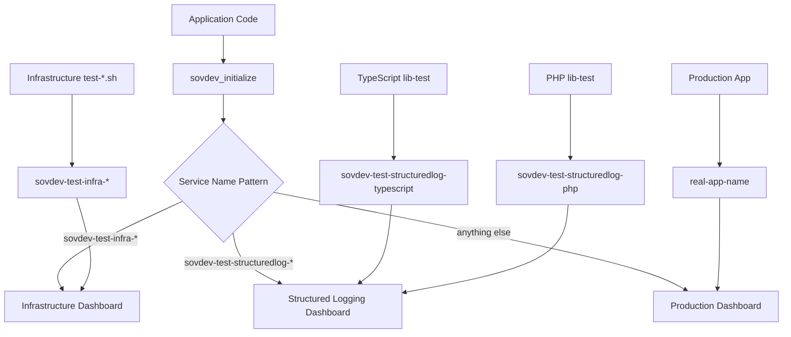

# 📊 sovdev Observability Architecture

> **📖 For Complete Architecture Details:** See [specification/05-environment-configuration.md](../specification/05-environment-configuration.md) for DevContainer setup, architecture diagrams, and infrastructure configuration.

## 🎯 Overview

This document explains how to verify that your sovdev-logger implementation is working correctly by checking logs in Grafana dashboards. The architecture separates concerns between testing verification and production monitoring while maintaining consistency across all programming languages.

## 📋 Three-Dashboard Architecture

### 1. Infrastructure Testing Dashboard
- **File**: `dev-observability-stack/grafana/dashboards/test-dev-observability-infra-dashboard.json`
- **Purpose**: Verify OTLP pipeline connectivity and observability stack health
- **Filter**: `service_name =~ /^sovdev-test-infra-.*/`
- **Use Cases**:
  - OTLP collector connectivity verification
  - Loki ingestion testing
  - Pipeline health monitoring
  - Infrastructure troubleshooting

### 2. Structured Logging Testing Dashboard
- **File**: `dev-observability-stack/grafana/dashboards/test-dev-observability-structuredlog-dashboard.json`
- **Purpose**: Verify structured logging library implementations across all languages
- **Filter**: `service_name =~ /^sovdev-test-structuredlog-.*/`
- **Use Cases**:
  - Library implementation verification
  - Cross-language consistency checking
  - "Loggeloven av 2025" compliance validation
  - Developer integration testing

### 3. Production Monitoring Dashboard
- **File**: `dev-observability-stack/grafana/dashboards/structuredlog-dashboard.json`
- **Purpose**: Monitor real application logs in production and development
- **Filter**: `service_name AND service_name !~ /^sovdev-test-.*/`
- **Use Cases**:
  - Application health monitoring
  - Error tracking and alerting
  - Performance insights
  - Business logic monitoring

## 🏷️ Service Name Naming Convention

The `service_name` parameter passed to `sovdev_initialize()` determines which dashboard will display the logs:

### Infrastructure Testing
```bash
# Used by dev-observability-stack/test-*.sh scripts
sovdev_initialize("sovdev-test-infra-raw-logs")
sovdev_initialize("sovdev-test-infra-otlp-connectivity")
sovdev_initialize("sovdev-test-infra-loki-ingestion")
```

### Structured Logging Testing

**Available Implementations:**
```typescript
// TypeScript ✅
sovdev_initialize("sovdev-test-structuredlog-typescript")
```

**Planned Implementations:**
```go
// Go (planned)
SovdevInitialize("sovdev-test-structuredlog-go")
```

```python
# Python (planned)
sovdev_initialize("sovdev-test-structuredlog-python")
```

```csharp
// C# (planned)
SovdevLogger.Initialize("sovdev-test-structuredlog-csharp")

// PHP (planned)
sovdev_initialize("sovdev-test-structuredlog-php")

// Rust (planned)
sovdev_initialize("sovdev-test-structuredlog-rust")
```

### Production Applications
```typescript
// Real application names
sovdev_initialize("user-management-service")
sovdev_initialize("payment-processor")
sovdev_initialize("inventory-system")
sovdev_initialize("INT0001001")  // Red Cross style system IDs
```

## 🔍 How to Verify Your Implementation

### For Library Developers

#### 1. Run Your Language's Test

**Available Languages:**
```bash
# TypeScript ✅
cd typescript && npm run lib-test
```

**Or use the validation wrapper (recommended):**
```bash
./specification/tools/run-company-lookup-validate.sh typescript
```

**Planned Languages:**
```bash
# Go (planned)
./specification/tools/run-company-lookup-validate.sh go

# Python (planned)
./specification/tools/run-company-lookup-validate.sh python
```

**Future Planned Languages:**
```bash
# C# (planned)
dotnet run lib-test

# PHP (planned)
composer run lib-test

# Rust (planned)
cargo run --example lib-test
```

#### 2. Check the Structured Logging Dashboard
- Open Grafana: `http://localhost:3000`
- Navigate to: **test-dev-observability-structuredlog-dashboard**
- Look for logs with your service_name: `sovdev-test-structuredlog-{language}`

#### 3. Verify Required Functionality
The dashboard should show evidence of:
- ✅ **Basic structured logging**: All required fields present
- ✅ **Job lifecycle tracking**: Start → Progress → Completion
- ✅ **Error handling**: Exception logging with stack traces
- ✅ **Trace-log correlation**: Trace IDs in log entries
- ✅ **All log levels**: TRACE, DEBUG, INFO, WARN, ERROR, FATAL

### For Infrastructure Maintainers

#### 1. Run Infrastructure Tests
```bash
cd dev-observability-stack
./test-raw-logs.sh
./test-otlp-connectivity.sh
```

#### 2. Check the Infrastructure Dashboard
- Open Grafana: `http://localhost:3000`
- Navigate to: **test-dev-observability-infra-dashboard**
- Look for logs with service_names: `sovdev-test-infra-*`

#### 3. Verify Pipeline Health
The dashboard should show:
- ✅ **OTLP connectivity**: Logs reaching the collector
- ✅ **Loki ingestion**: Data flowing to Loki
- ✅ **Component health**: All observability stack components running

### For Application Developers

#### 1. Deploy Your Application
```typescript
// In your application code
sovdev_initialize("my-application-name");
```

#### 2. Check the Production Dashboard
- Open Grafana: `http://localhost:3000`
- Navigate to: **structuredlog-dashboard**
- Look for logs with your application's service_name

## 🏗️ Architecture Flow



## 📊 Data Flow

### 1. Log Generation

**TypeScript:**
```typescript
sovdev_log(SOVDEV_LOGLEVELS.INFO, "MyFunction", "Processing started", PEER_SERVICES.INTERNAL,
       {userId: 123}, {status: "started"});
```

**Go:**
```go
sovdevlogger.SovdevLog(sovdevlogger.INFO, "MyFunction", "Processing started", peerServices.INTERNAL,
       map[string]interface{}{"userId": 123}, map[string]interface{}{"status": "started"}, nil, "")
```

**Python:**
```python
sovdev_log(SOVDEV_LOGLEVELS.INFO, "MyFunction", "Processing started", PEER_SERVICES['INTERNAL'],
       {'userId': 123}, {'status': 'started'})
```

### 2. OpenTelemetry Processing
- Winston captures the log
- OpenTelemetry auto-instrumentation adds trace context
- OTLP exporter sends to observability stack

### 3. Observability Stack
- OTLP Collector receives logs and traces
- Data flows to Loki (logs) and Tempo (traces)
- Grafana queries both for correlated observability

### 4. Dashboard Display
- Grafana filters logs by service_name pattern
- Displays in appropriate dashboard
- Shows trace-log correlation

## 🎯 Design Principles

### Separation of Concerns
- **Infrastructure testing**: Focuses on pipeline health
- **Library testing**: Focuses on implementation compliance
- **Production monitoring**: Focuses on application health

### Language Consistency
All programming languages implement:
- Identical `lib-test` functionality
- Same structured log format
- Consistent service_name naming
- Same verification process

### Future-Proof Naming
The `sovdev-test-*` prefix allows adding new test categories without changing dashboard filters:
```bash
# Current
sovdev-test-infra-*
sovdev-test-structuredlog-*

# Future possibilities
sovdev-test-integration-*
sovdev-test-performance-*
sovdev-test-security-*
```

## 🔧 Configuration

### Environment Variables
```bash
# Required for OTLP integration
export OTEL_EXPORTER_OTLP_TRACES_ENDPOINT=http://host.docker.internal:4318/v1/traces
export OTEL_EXPORTER_OTLP_LOGS_ENDPOINT=http://host.docker.internal:4318/v1/logs

# Optional for file logging
export LOG_TO_FILE=true
export LOG_FILE_PATH=./logs/dev.log
export NODE_ENV=development
```

### Grafana Access
- **URL**: http://localhost:3000
- **Default Credentials**: admin/admin
- **Dashboards**: Navigate to Dashboards → Browse

## 🚀 Getting Started

### 1. Start the Observability Stack
See [specification/05-environment-configuration.md](../specification/05-environment-configuration.md) for complete setup instructions.

### 2. Run a Library Test

**Choose your language:**

```bash
# TypeScript
./specification/tools/run-company-lookup-validate.sh typescript

# Go
./specification/tools/run-company-lookup-validate.sh go

# Python
./specification/tools/run-company-lookup-validate.sh python
```

### 3. Verify in Grafana
- Open http://localhost:3000 (or http://grafana.localhost)
- Navigate to **test-dev-observability-structuredlog-dashboard**
- Look for logs with your service name:
  - `sovdev-test-structuredlog-typescript`
  - `sovdev-test-structuredlog-go`
  - `sovdev-test-structuredlog-python`

### 4. Understand the Output
The dashboard should show your test logs with all required structured fields and trace correlation. All three language implementations produce identical log structures.

## 📋 Troubleshooting

### No Logs in Dashboard
1. **Check OTLP endpoints**: Verify environment variables are set
2. **Check service_name**: Ensure it matches the expected pattern
3. **Check observability stack**: Verify all Docker containers are running
4. **Check time range**: Grafana might be showing wrong time period

### Missing Trace Correlation
1. **Verify OpenTelemetry SDK**: Check that auto-instrumentation is enabled
2. **Check Winston integration**: Ensure `@opentelemetry/instrumentation-winston` is configured
3. **Verify active spans**: Check that spans are active when logging occurs

### Wrong Dashboard
1. **Check service_name pattern**: Ensure it matches the intended dashboard filter
2. **Verify naming convention**: Follow the `sovdev-test-{category}-{specific}` pattern
3. **Check filters**: Verify dashboard queries are using correct regex patterns

## 📚 Related Documentation

**For Library Users:**
- [Configuration Guide](./README-configuration.md) - Environment variables and setup
- [Log Data Structure](./logging-data.md) - Field reference and patterns
- [TypeScript README](../typescript/README.md) - TypeScript-specific guide
- [Go README](../go/README.md) - Go-specific guide (coming soon)
- [Python README](../python/README.md) - Python-specific guide (coming soon)

**For Library Implementers:**
- [Specification](../specification/README.md) - Complete implementation requirements
- [Environment Configuration](../specification/05-environment-configuration.md) - DevContainer setup and architecture
- [OTEL SDK Guide](../specification/10-otel-sdk.md) - Critical SDK differences across languages
- [Implementation Checklist](../specification/11-llm-checklist-template.md) - Track your progress

**For Compliance:**
- [Loggeloven Requirements](./README-loggeloven.md) - Norwegian Red Cross logging requirements

## 🎯 Summary

This architecture provides:
- **Clear separation** between testing and production
- **Consistent verification** across all programming languages  
- **Future-proof design** for new test categories
- **Developer-friendly workflow** for validation
- **Comprehensive observability** from development to production

The three-dashboard approach ensures developers can quickly verify their implementations while maintaining clean separation between infrastructure concerns, library verification, and production monitoring.